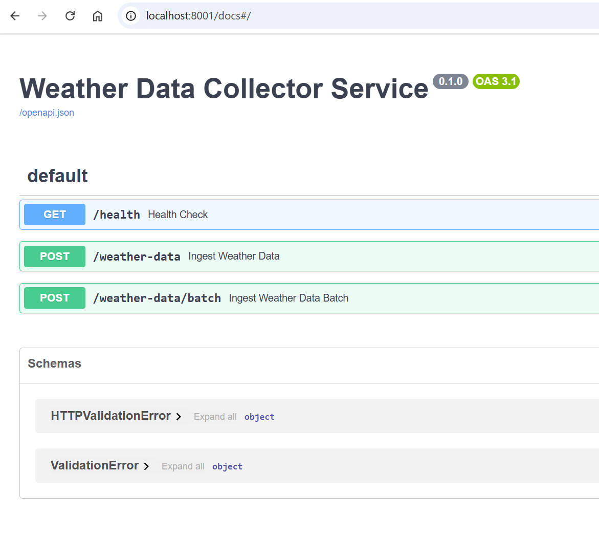
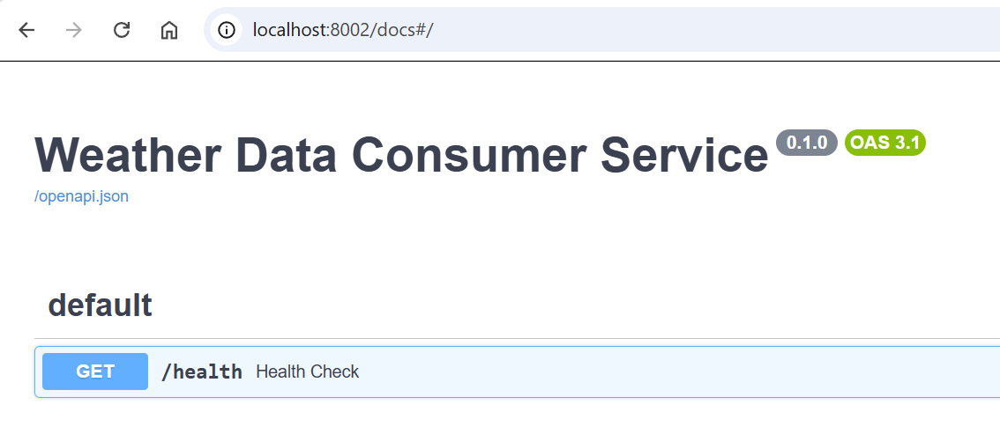

# Weather System Pipeline

A high-performance weather data ingestion and query system built with FastAPI, Kafka, PostgreSQL (TimescaleDB), and Redis.

## Quick Start

### Prerequisites
- Docker
- Docker Compose

### Running the System
For first-time setup, build all services before starting them:
```bash
docker compose build
docker compose up -d
```

For subsequent runs, you can simply use:
```bash
docker compose up -d
```

### Running Tests
Execute all tests:
```bash
docker compose run test
```

## System Design

This system implements at-least-once semantics, optimized for high-throughput data ingestion. The architecture ensures:
- Reliable data ingestion through Kafka's at-least-once delivery guarantee
- In-memory deduplication in the Consumer service
- Additional deduplication during database insertion using TimescaleDB's unique constraints
- Efficient time-series data storage using TimescaleDB extension, optimized for large-scale time-series data ingestion and querying

### Architecture Diagram
To view the system architecture, see the flowchart in `Weather Data Ingestion.png`. To add this diagram to the README, move the file to the `docs` directory and update the reference as follows:

```markdown

```

## API Documentation
When the system is running, access the API documentation at:
- Collector Service: http://localhost:8001/docs
- Consumer Service: http://localhost:8002/docs
- Query Service: http://localhost:8003/docs
- Generator Service: http://localhost:8004/docs

### Service API Overviews

#### Generator Service
The Generator Service simulates weather stations and sends data to the Collector Service. It provides endpoints to start and stop data generation.


#### Collector Service
The Collector Service receives weather data from stations (or the Generator), validates it, and publishes it to Kafka. It includes endpoints for data ingestion and health monitoring.



#### Consumer Service
The Consumer Service reads data from Kafka, processes it for deduplication, and stores it in the TimescaleDB database. It provides endpoints to view consumer statistics and health status.



#### Query Service
The Query Service retrieves data from the database and provides endpoints for querying raw weather data, aggregated statistics, and time-series analysis.


## Using the System

### 1. Generate Test Data

The system includes a data generator service to simulate weather stations sending data:

1. Access the Generator Service documentation at http://localhost:8004/docs
2. Use the `/start` endpoint to begin generating data. This will create weather data for multiple stations.

   

3. After generating enough data (a few seconds is usually sufficient), use the `/stop` endpoint to stop the generator.

### 2. Query the Data

Once data has been generated and processed, you can query it using the Query Service:

1. Access the Query Service documentation at http://localhost:8003/docs
2. Use the `/weather/{station_id}` endpoint to retrieve weather data for a specific station. You can optionally provide start_time and end_time parameters to filter by date range.

   

3. The API will return all weather data for the requested station, ordered by timestamp.

### 3. Advanced Querying

The Query Service also provides advanced data retrieval endpoints:

1. **Aggregate Data**: Use `/weather/aggregate/{station_id}` to get statistical summaries (min, max, average) of weather measurements for a specific station and time range.

2. **Time-series Analysis**: Use `/weather/timeseries/{station_id}` to get time-bucketed data aggregations. This uses TimescaleDB's time_bucket function to group data into intervals, allowing for trend analysis.

## Monitoring

### View Service Logs
```bash
# View collector logs
docker compose logs collector -f

# View consumer logs
docker compose logs consumer -f

# View query service logs
docker compose logs query -f
```

### Logging and Monitoring
The system uses structured logging compatible with Datadog agents. All logs include:
- Trace IDs for request tracking
- Service name
- Log level
- Timestamp

When Datadog agents are installed, they can automatically collect these logs for:
- Distributed tracing
- Performance monitoring
- Error tracking
- Metrics visualization 

## Troubleshooting

### Consumer Service Kafka Connection Issues

If you see errors like these in the consumer logs:
```
ERROR:aiokafka.consumer.group_coordinator:Error sending JoinGroupRequest_v5 to node 1 [[Error 7] RequestTimedOutError]
WARNING:aiokafka.cluster:Topic weather_data is not available during auto-create initialization
```

These indicate that the consumer is having trouble connecting to Kafka. Here's how to fix it:

1. **Ensure Kafka is fully initialized**:
   ```bash
   docker compose logs kafka | grep "started"
   ```
   You should see a message indicating Kafka has started successfully.

2. **Restart the consumer service**:
   ```bash
   docker compose restart consumer
   ```

3. **Create the topic manually** (if it doesn't exist):
   ```bash
   docker compose exec kafka kafka-topics --create --topic weather_data --bootstrap-server localhost:9092 --partitions 1 --replication-factor 1
   ```

4. **Verify the topic exists**:
   ```bash
   docker compose exec kafka kafka-topics --list --bootstrap-server localhost:9092
   ```

### No Data Appearing in Query Results

If you've generated data but nothing appears in your query results:

1. **Check if consumer is processing messages**:
   ```bash
   docker compose logs consumer | grep "Processing message"
   ```
   
2. **Verify data is in the database**:
   ```bash
   docker compose exec postgres psql -U weather_user -d weather_db -c "SELECT COUNT(*) FROM weather;"
   ```

3. **Generate more data** with the generator service if needed.

## Considered but Not Implemented

For the purpose of this demo, several advanced features were considered but not implemented to maintain simplicity and clarity:

### Push vs Pull Model
- Current implementation uses a **Push Model** where weather stations send data to our collector service
- A **Pull Model** would be more efficient in production, where our system would:
  - Use service discovery (e.g., Consul, etcd) to maintain registry of weather stations
  - Implement Kubernetes for pod management and scaling
  - Actively poll weather stations at configured intervals
  - Better handle station failures and network issues
  - Allow for more controlled data ingestion rates
- Pull model was not implemented to align with the initial requirements and keep the demo infrastructure simpler

### Load Testing
- **k6** would be ideal for end-to-end load testing of this system:
  - Can simulate multiple weather stations pushing data
  - Supports WebSocket and HTTP protocols
  - Allows testing different load patterns
  - Provides detailed performance metrics
  - Can integrate with CI/CD pipelines
- Not implemented to keep the demo focused on core functionality

### Load Balancer Enhancements
- **Rate Limiting**: Could prevent abuse and ensure fair resource distribution
- **SSL Termination**: Would add HTTPS support at the load balancer level
- **Advanced Health Checks**: More sophisticated service health monitoring
- **Circuit Breakers**: Would help prevent cascading failures

### Query Service Optimizations
- **Cursor-based Pagination**: Would improve handling of large datasets using timestamp-based cursors
- **Async Job System**: For handling long-running queries without blocking
- **Query Timeouts**: To prevent long-running queries from consuming resources
- **Advanced Caching Strategies**: More sophisticated cache invalidation and warming

### Data Management
- **Data Retention Policies**: Automated cleanup of old time-series data
- **Continuous Aggregates**: Pre-calculated aggregations for common time windows
- **Partitioning Strategies**: Advanced TimescaleDB chunk management

These features would be valuable in a production environment but were omitted to keep the demo focused and maintainable. 